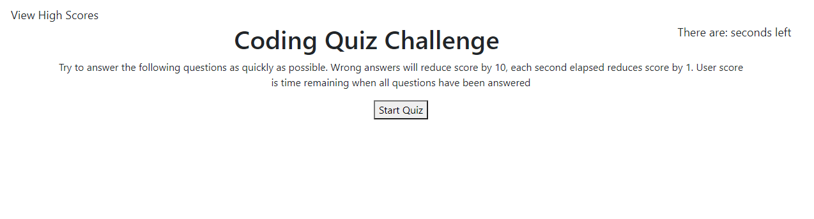
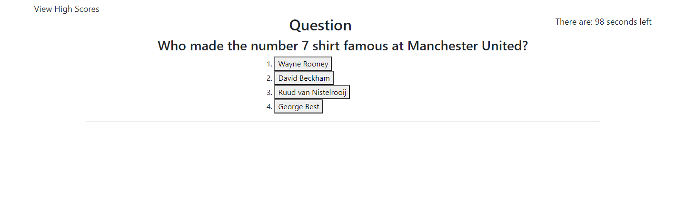
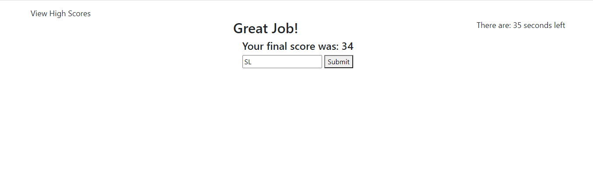
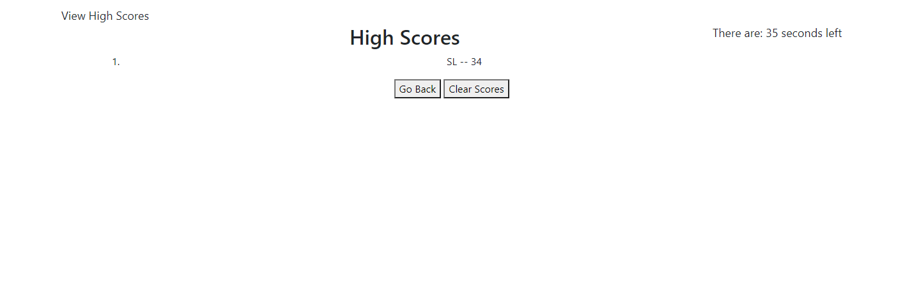

# Manchester United Speed Quiz

## Summary
The request was to create a time based online quiz around the history of and facts about Manchester United FC.

Using a combination of HTML, CSS, and javascript, I built an application that provided users with a quiz that asks questions as a timer counts down until they have answered each question. 

The user's score is set as the amount of time remaining on the timer when the user finishes the quiz. For each question answered incorrectly, the timer is reduced by ten seconds as well.

Once the game has ended, the user is provided with their score, and the option to enter their initials. If they submit their initials, their score and initials will be added to a high scores list, which will be displayed upon submitting initials.

At this point, the user can either go back to the beginning of the game and play again, or clear the high score list (which can be accessed from the link at the top left of the page at any time).

## Example of Page by Game Section

**Start Page**

**Quiz Page**

**End Game Page**

**High Scores Page**

## Pseudo Code & Key Code Elements

**HTML Setup**

Begin by creating a high score link and a timer at the top of the page. This area will not change regardless of stage of the 

## Built With

* [HTML](https://developer.mozilla.org/en-US/docs/Web/HTML)
* [CSS](https://developer.mozilla.org/en-US/docs/Web/CSS)
* [Javascript](https://developer.mozilla.org/en-us/docs/web/javascript)

## Deployed Link

* [See Live Site](https://slimbeek6.github.io/speed_quiz_SML/)

## Authors

**Shaun Limbeek** 
- [Link to Portfolio](https://slimbeek6.github.io/SML_Portfolio/index.html)
- [Link to Github](https://github.com/slimbeek6/)
- [Link to LinkedIn](https://www.linkedin.com/in/shaun-limbeek/)